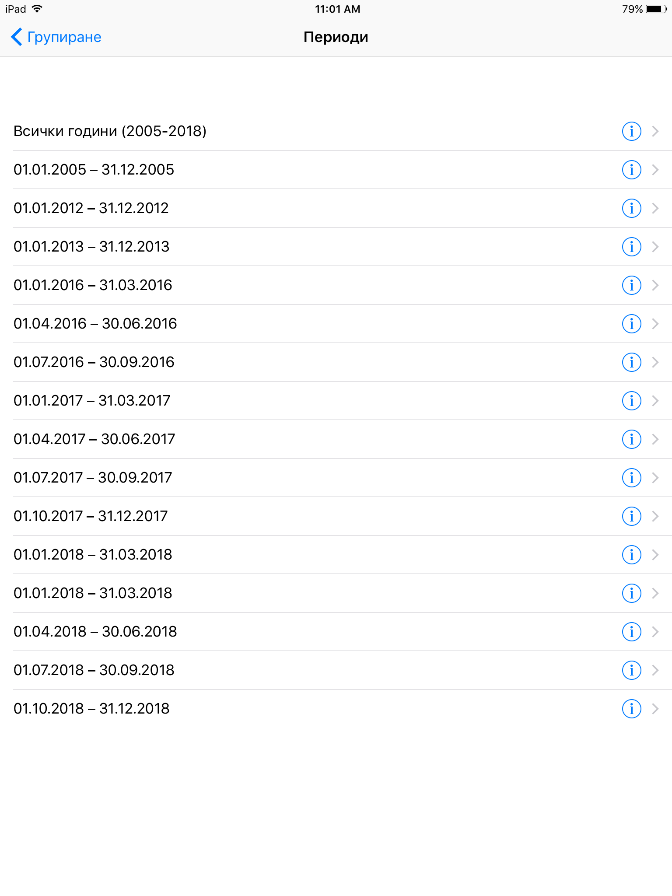

# iOS приложение, визуализиращо нивото на фините прахови частици в България за периода 2005-2018г

## Ресурси

Приложението използва [набор от данни](https://data.egov.bg/data/view/f7d45237-a310-4c43-b37f-db434f8edf3d), предоставен от националния портал за отворени данни.

## Снимки от приложението

<table>
    <tr>
        <td width="33%">
            
        </td>
        <td width="33%">
            
    </tr>
    <tr>
        </td>
        <td width="33%">
            
        </td>
        <td width="33%">
            
        </td>
    </tr>
    <tr>
        <td width="33%">
            
        </td>
        <td width="33%">
            
        </td>
    </tr>
    <tr>
        <td width="33%">
            
        </td>
        <td width="33%">
            
        </td>
    </tr>
    <tr>
        <td width="33%">
            
        </td>
        <td width="33%">
            
        </td>
    </tr>
    <tr>
        <td width="33%">
            
        </td>
    </tr>
</table>

## Лиценз

[MIT](LICENSE)